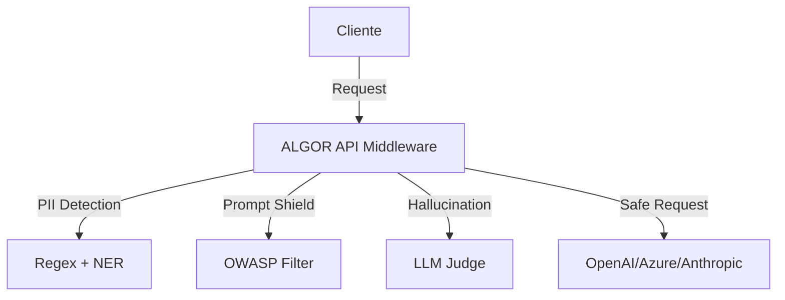

# PLANO DE EXECUÇÃO ESTRATÉGICA: REGULATION-AS-CODE (90 DIAS)

> **Status:** PROPOSTA DE EXECUÇÃO
> **Tese Central:** Transformar Compliance de "Custo/Bloqueio" em "Aceleração de Orçamento".
> **Meta:** R$ 36k - R$ 50k MRR em 90 dias.

---

## 1. PREMISSA FUNDAMENTAL
**Não vendemos Governança.** Vendemos **"Compliance Automatziado que Destranca Orçamento de IA"**.
*   **Valor Antigo (Consultoria):** Proteção, Custo, Medo.
*   **Valor Novo (Infraestrutura):** Aceleração, ROI, Segurança Jurídica como Diferencial Competitivo.

---

## 2. ROADMAP DE EXECUÇÃO (90 DIAS)

### 🗓️ FASE 1: MVP FREEMIUM HIPERFOCADO (DIAS 1-30)
**Produto:** `AI Compliance Scanner Brasil`
**Objetivo:** Tração Massiva e Coleta de Dados.

#### O Que Ele Faz (Diferencial Único)
Input: Cliente conecta API de IA (OpenAI, Azure, Claude).
Output: Relatório com 3 métricas críticas:
1.  **Risco LGPD:** % de requisições que expuseram CPF/Geolocalização (Ref: Art. 5º, inciso X + Resolução ANPD 1/2024).
2.  **Risco Operacional:** % de alucinações detectadas (Quantificação de erro financeiro).
3.  **Risco OWASP:** % de tentativas de *Prompt Injection* (Top 1 Vulnerability 2026).

**Diferencial:** Cada métrica cita o artigo específico da legislação brasileira + valor estimado de multa ANPD.

#### Tech Stack (Lean & Scalable)
*   **Frontend:** Next.js + Vercel (Custo: R$ 0)
*   **Backend:** Supabase (Custo: ~R$ 200/mês)
*   **Observability:** Langfuse self-hosted (AWS) (Custo: ~R$ 500/mês)
*   **LLM Judge:** Claude Haiku via API (Custo: ~R$ 300/mês para 10k scans)
*   **CI/CD:** GitHub Actions
*   **Custo Total Infra:** ~R$ 1.000/mês.

#### Go-to-Market (GTM)
*   **Semana 1-2:** Build MVP.
*   **Semana 3:** Beta Fechado (10 empresas via LinkedIn Outreach).
*   **Semana 4:** Public Launch + Primeiro Relatório Agregado.
*   **KPIs:** 50 empresas testando, 3-5 conversões pagas (R$ 2k/mês). **Meta: R$ 6k MRR.**

---

### 🗓️ FASE 2: ENTERPRISE BEACHHEAD (DIAS 31-60)
**Produto:** `Auditoria de Fornecedor de IA` (O "Reverse Trojan")
**Objetivo:** Conversão de Ticket Alto e Lock-in.

#### Mecânica de Vendas ("Auditoria com Garantia")
1.  **Alvo:** Empresas médias contratando projetos de IA (Bancos Regionais, Varejo, Indústria).
2.  **Oferta:** "Auditamos seu fornecedor de IA. Se encontrarmos >R$ 100k em riscos, você paga R$ 10k. Se não, é grátis."
3.  **Deliverable:** Relatório de 20 páginas mapeando riscos técnicos e financeiros + cláusulas contratuais exigidas.

#### O Resultado ("Reverse Trojan")
*   O Cliente final **EXIGE** que o fornecedor use a infraestrutura ALGOR para mitigar o risco apontado.
*   Você entra como "Layer Obrigatório" no projeto.
*   **Modelo:** Fornecedor paga R$ 20k Setup + R$ 5k/mês Ongoing.

#### Metas Fase 2
*   15 reuniões Enterprise -> 1 Contrato Fechado.
*   **Adicional:** R$ 20k MRR.
*   **Acumulado:** R$ 26k MRR.

---

### 🗓️ FASE 3: PRODUTO ESCALÁVEL (DIAS 61-90)
**Produto:** `API de Guardrails` (Middleware de Governança)
**Objetivo:** Escala via API e Marketplace.

#### Arquitetura Técnica

#### Modelo de Negócio
*   **Preço:** R$ 10,00 por 1M de tokens processados.
*   **Margem:** ~75%.

#### Parceria Estratégica (Canal de Distribuição)
*   **Azure/AWS Marketplace:** Tornar-se parceiro certificado.
*   **Vantagem:** Cliente compra via procurement existente da Cloud (fricção reduzida em 80%).

#### Metas Fase 3
*   2 Clientes Beta API (R$ 5k/mês cada).
*   Aprovação Azure Marketplace em andamento.
*   **Acumulado:** R$ 36k MRR (R$ 6k Freemium + R$ 20k Enterprise + R$ 10k API).

---

## 3. O FOSSO DEFENSÁVEL (THE MOAT)
**Por que a Microsoft/OpenAI não vão nos matar?**
Não competimos em tecnologia bruta, competimos em **Interpretação Regulatória Local**.

| Feature | Azure Content Safety (Global) | ALGOR API (Local) |
| :--- | :--- | :--- |
| **PII** | Filtra e-mail/telefone genérico. | Filtra CPF, CNPJ, Geolocalização (Cidade+Bairro). |
| **Contexto** | Ignora nuances da LGPD vs GDPR. | Implementa resoluções da ANPD no dia D+1. |
| **Compliance** | Genérico. | Bloqueia baseado em PL 2338 (IA de Alto Risco). |

**Vantagem Competitiva:** Atualização dos guardrails em tempo real com novas resoluções da ANPD. A Microsoft leva 6 meses.

---

## 4. ESTRUTURA E FINANCEIRO

### Os 3 Riscos Fatais
1.  **PL 2338 não passar/diluído:** Mitigar focando em valor operacional (redução de bugs/alucinação) e não apenas legal.
2.  **Ciclo de Vendas Lento:** Mitigar com pipeline de 5 oportunidades e oferta de "Garantia de ROI".
3.  **Engenheiro Sênior Sair:** Mitigar com Vesting (1 year cliff) e documentação obsessiva.

### Cenários de Execução
*   **Cenário A (Ideal - R$ 300k Caixa):** Você (CEO) + Eng. Fullstack Sênior + Legal Tech.
*   **Cenário B (Realista - Bootstrap):** **Parceria Estratégica**.
    *   Encontrar Software House média (20-50 pessoas) que já sofre com objeções de compliance.
    *   Proposta: 60/40 Split. Eles dão o time técnico, você dá o produto e a venda.

---

## 5. AJUSTES CRÍTICOS E GATILHOS

### Ajuste Tático 1: Parceria Day 1
Não tente contratar e queimar caixa se não tiver os R$ 300k. A parceria reduz o CAPEX a zero e acelera a validação.

### Ajuste Tático 2: "Relatório Estado da IA Brasil 2026" (Dia 45)
Utilizar os dados agregados do Scanner Freemium para publicar o primeiro benchmark real do setor. Enviar para ANPD, ABES e imprensa para ganhar autoridade técnica imediata.

### A PERGUNTA DECISIVA (GO / NO-GO)
**Você tem R$ 300k em caixa OU um parceiro técnico comprometido?**
*   **SIM:** Execute o roadmap de 90 dias integralmente.
*   **NÃO:** Foque 100% em fechar a parceria estratégica primeiro. Não inicie o desenvolvimento solo.

---
*Documento gerado com base na Estratégia "Regulação-as-Code em 90 Dias".*
