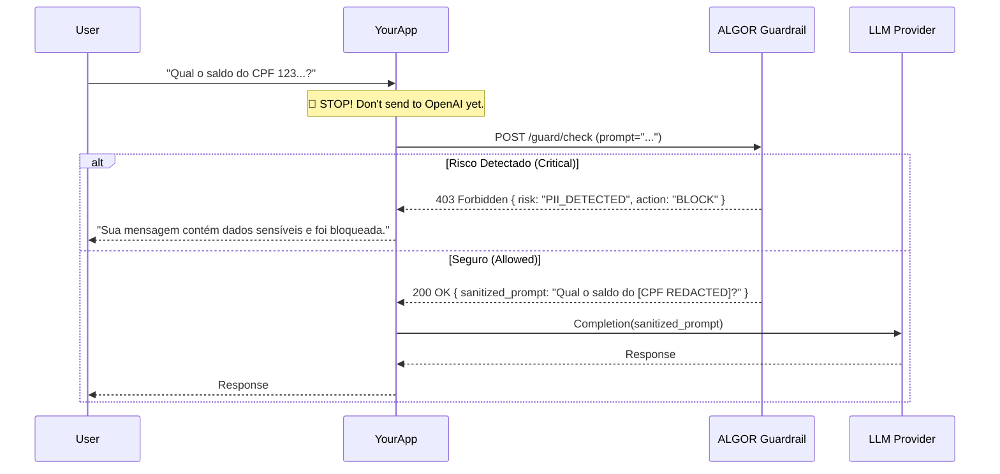

# ALGOR Guardrail API: Guia de Integração (Developer Docs)

> **Versão:** 1.0.0-beta
> **Endpoint Base:** `https://api.algorbrasil.com/v1`
> **Status:** **DRAFT** para Software Houses homologadas.

---

## 1. Visão Geral
A **ALGOR Guardrail API** atua como um *Middleware de Segurança* (Firewall) entre a sua aplicação e os Provedores de LLM (OpenAI, Azure, Anthropic).

**Objetivo:** Garantir que nenhum dado PII (LGPD) ou Prompt Malicioso (Injection) chegue ao modelo de IA, e que nenhuma resposta alucinada ou tóxica chegue ao usuário final.

### Arquitetura de Integração (Synchronous Blocking)
Recomendamos o padrão de bloqueio síncrono para aplicações críticas (Fintech, Saúde).



---

## 2. API Reference

### `POST /guard/check`
Analisa um input de texto antes de enviá-lo ao LLM.

**Headers:**
*   `Authorization: Bearer <YOUR_API_KEY>`
*   `Content-Type: application/json`

**Body (JSON):**
```json
{
  "project_id": "proj_123456",
  "content": "Gere um contrato para o Roberto, CPF 123.456.789-00",
  "metadata": {
    "user_id": "user_88",
    "session_id": "sess_abc",
    "environment": "production"
  }
}
```

**Response (200 OK - Allowed):**
```json
{
  "id": "trace_9999",
  "verdict": "ALLOWED",
  "risk_score": 0.05,
  "modified_content": "Gere um contrato para o Roberto, CPF [CPF REMOVIDO]",
  "anonymized": true
}
```

**Response (200 OK - Blocked):**
*Nota: Retornamos 200 OK mesmo no bloqueio para facilitar o tratamento de erro no client, mas com verdict BLOCKED.*
```json
{
  "id": "trace_9999",
  "verdict": "BLOCKED",
  "risk_score": 0.98,
  "block_reason": "PII_CRITICAL",
  "details": "CPF detected in high-risk context"
}
```

---

## 3. SDK Examples

### Python (Usando requests)
A forma mais simples de integrar em seu backend (FastAPI/Django/Flask).

```python
import requests

ALGOR_API_KEY = "sk_algor_..."

def safe_chat_completion(user_input):
    # 1. Check Guardrail
    response = requests.post(
        "https://api.algorbrasil.com/v1/guard/check",
        headers={"Authorization": f"Bearer {ALGOR_API_KEY}"},
        json={"content": user_input}
    )
    
    guard_result = response.json()
    
    if guard_result['verdict'] == 'BLOCKED':
        # Fallback seguro
        return "Desculpe, sua mensagem viola nossas políticas de segurança (Erro: {})".format(guard_result['block_reason'])
    
    # 2. Call LLM with SANITIZED content
    safe_prompt = guard_result['modified_content'] # Algor removeu o CPF
    
    # ... call OpenAI(safe_prompt) ...
    return llm_response
```

### Node.js / TypeScript

```typescript
import axios from 'axios';

async function checkSafety(prompt: string) {
  try {
    const { data } = await axios.post('https://api.algorbrasil.com/v1/guard/check', {
      content: prompt
    }, {
      headers: { 'Authorization': `Bearer ${process.env.ALGOR_KEY}` }
    });

    if (data.verdict === 'BLOCKED') {
      throw new Error(`Security Block: ${data.block_reason}`);
    }

    return data.modified_content; // Use this safe string
  } catch (error) {
    console.error("Guardrail check failed", error);
    // Fail closed (segurança por padrão)
    throw error;
  }
}
```

---

## 4. Desempenho e Latência
Sabemos que performance é crítica.
*   **Latência Média:** ~150ms (Processamento Regex + NER Local).
*   **Latência Máxima:** ~800ms (Se usar LLM Judge para análise semântica complexa).
*   **SLA:** 99.9% Uptime.

## 5. Próximos Passos
1.  Solicite sua **API Key de Homologação**.
2.  Instale o middleware em ambiente de **Staging**.
3.  Execute a bateria de testes de injeção ("mock_logs_teste.json").
