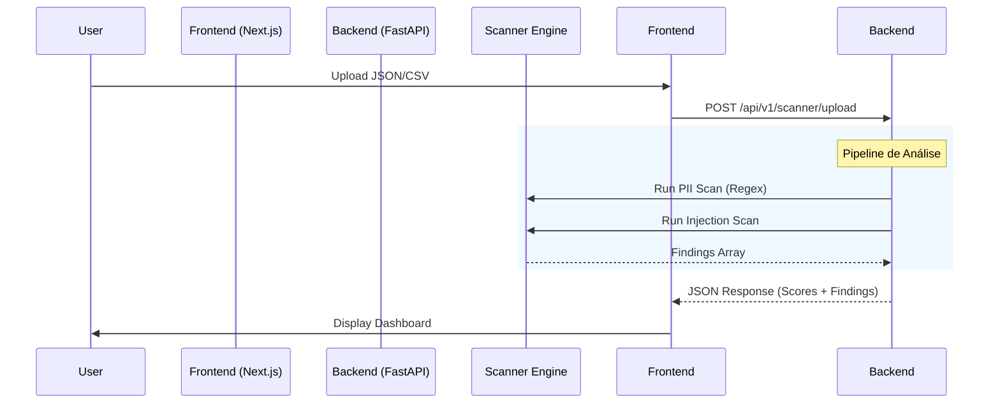

# ESPECIFICAÇÃO TÉCNICA: AI COMPLIANCE SCANNER BRASIL (MVP FREEMIUM)

> **Versão:** 2.2 (SaaS Premium Redesign Update)
> **Última Atualização:** 24/12/2025
> **Objetivo:** Ferramenta "Self-Service" para quantificar riscos de IA (LGPD, Alucinação, Segurança).
> **Público:** Desenvolvedores, Líderes de Produto, CTOs, DPOs e Executivos C-Level.

---

## 1. VISÃO GERAL DO PRODUTO

O **AI Compliance Scanner Brasil** é uma ferramenta web onde o usuário submete um log de interações (JSON/CSV) ou conecta uma API Key (em ambiente seguro/sandbox) para receber um **Relatório de Diagnóstico Instantâneo**.

### 1.1 Fluxo do Usuário
1.  **Landing Page:** "Descubra se sua IA viola a LGPD em 30 segundos".
2.  **Input:**
    *   Upload de arquivo (`logs.json`, `dataset.csv`).
    *   *Opção Futura:* Proxy Endpoint (Middleware).
3.  **Processing:**
    *   Análise de PII (Regex BR + NER).
    *   Análise de Prompt Injection (OWASP Rules).
    *   Análise de Alucinação (LLM-as-a-Judge: Claude Haiku).
4.  **Output (Dashboard):**
    *   Score Geral (0-10).
    *   3 Cards de Risco (LGPD, Operacional, OWASP) com cifras estimadas de multa.
    *   Call-to-Action: "Corrigir isso com a ALGOR Enterprise".

---

## 2. ARQUITETURA TÉCNICA

### 2.1 Stack Tecnológico (Atual - Implementado)
*   **Frontend:** Next.js 14 (App Router) + TailwindCSS + Framer Motion + Recharts.
*   **Backend:** FastAPI (Python) integrado ao projeto existente.
*   **Gráficos:** Recharts (AreaChart, RadarChart, Gauges).
*   **Animações:** Framer Motion (Staggered Children, Spring, AnimatePresence).
*   **Ícones:** Lucide React.

### 2.2 Diagrama de Fluxo de Dados



---

## 3. MODELAGEM DE DADOS

### 3.1 Response Schema (`ScanResult`)
```typescript
interface ScanResult {
  total_rows: number;
  risks_found: number;
  lgpd_score: number;      // 0-100
  operational_score: number; // 0-100
  owasp_score: number;     // 0-100
  findings: Finding[];
}

interface Finding {
  category: "LGPD" | "OWASP" | "OPERATIONAL";
  severity: "LOW" | "MEDIUM" | "HIGH" | "CRITICAL";
  description: string;
  regulatory_ref: string;
  estimated_fine: number;
  row_index: number;
}
```

---

## 4. DASHBOARDS ENTERPRISE (V2.2 - PREMIUM UPDATE)

O SaaS foi atualizado com um Design System "Power BI Premium", focado em visualização de dados rica e dark mode profundo.

### 4.1 Design System
- **Paleta:** Dark Mode Premium (`#0A0E1A`, `#131825`)
- **Acentos:** Neon Green (`#00FF94`), Electric Blue (`#00A3FF`), Amber (`#F59E0B`).
- **Efeitos:** Backdrop Blur, Gradient Borders, Ambient Glows.

### 4.2 Dashboard Overview (`/dashboard`)
**Persona:** CEO/CFO (KPIs Executivos)

| Componente | Tipo Visual | Descrição |
|------------|-------------|-----------|
| `TrendChart` | Area Chart (Recharts) | Evolução histórica do "Trust Score" com gradiente. |
| `RiskRadar` | Radar Chart (Recharts) | Comparativo spider-web de 5 eixos de risco. |
| `KpiCard` | Cards Animados | Gauges circulares e barras de progresso "spring". |

### 4.3 Jornada de Adoção (`/dashboard/roadmap`)
**Persona:** CTO/Gerente de Projeto

| Componente | Tipo Visual | Descrição |
|------------|-------------|-----------|
| `TimelineItem` | Zig-Zag Layout | Cards alternados conectados por linha central. |
| `StatusNode` | Pulse Animation | Nó central que pulsa indicando a fase ativa. |
| `PhaseCard` | Glass Panel | Card detalhado com checklist e botão de ação. |

### 4.4 Inventário de IA (`/dashboard/inventory`)
**Persona:** DPO/Engenheiro de ML

| Componente | Tipo Visual | Descrição |
|------------|-------------|-----------|
| `AssetGrid` | Staggered Grid | Grade de ativos que carrega em cascata. |
| `AssetModal` | Premium Modal | Modal com inputs translúcidos e borda neon. |
| `FilterPills` | Interactive Chips | Filtros visuais para Modelos, Datasets e Sistemas. |

---

## 5. DETALHAMENTO DO MOTOR DE ANÁLISE

### 5.1 Módulo 1: Risco LGPD (PII) - **IMPLEMENTADO**
*   **Ferramenta:** Regex Customizado BR.
*   **Padrões:** CPF, CNPJ, E-mail, Telefone.
*   **Ação:** Calcula multa estimada baseada em artigo LGPD.

### 5.2 Módulo 2: Risco OWASP (Injection) - **IMPLEMENTADO**
*   **Ferramenta:** Lista de padrões conhecidos (Jailbreak vectors).
*   **Keywords:** "Ignore previous instructions", "DAN mode", etc.

### 5.3 Módulo 3: Risco Operacional (Alucinação) - **MOCKADO**
*   **Status:** Preparado para integração com LLM.

---

## 6. SECURITY HARDENING (BLINDAGEM)

### 6.1 Limites de Recurso (DoS Protection)
*   **Max File Size:** 5MB.
*   **Row Limit:** 10.000 linhas.
*   **Memory Safety:** Processamento em RAM.

### 6.2 Validação de Input
*   **MIME Type Check:** `application/json`, `text/csv`.
*   **Defensive Parsing:** Try/catch robustos.

---

## 7. ARQUIVOS IMPLEMENTADOS (Principais)

```
frontend/components/dashboard/
├── OverviewCharts.tsx       # Gráficos Recharts (Novo)
├── inventory/CreateAssetModal.tsx # Modal Premium (Novo)
...

frontend/app/dashboard/
├── page.tsx                 # Overview Redesign
├── roadmap/page.tsx         # Roadmap Redesign
├── inventory/page.tsx       # Inventory Redesign
...
```

---

*Fim da Especificação Técnica v2.2*
