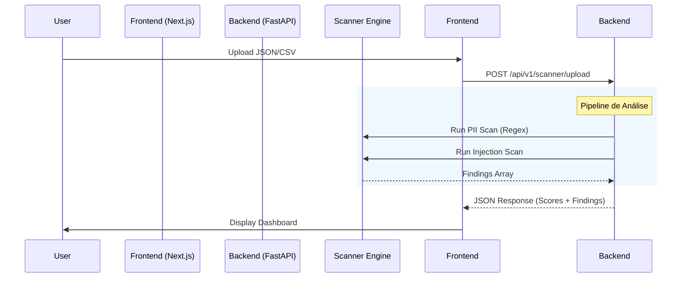

# ESPECIFICAÇÃO TÉCNICA: AI COMPLIANCE SCANNER BRASIL (MVP FREEMIUM)

> **Versão:** 2.0 (MVP + Enterprise Dashboards)
> **Última Atualização:** 23/12/2025
> **Objetivo:** Ferramenta "Self-Service" para quantificar riscos de IA (LGPD, Alucinação, Segurança).
> **Público:** Desenvolvedores, Líderes de Produto, CTOs, DPOs e Executivos C-Level.

---

## 1. VISÃO GERAL DO PRODUTO

O **AI Compliance Scanner Brasil** é uma ferramenta web onde o usuário submete um log de interações (JSON/CSV) ou conecta uma API Key (em ambiente seguro/sandbox) para receber um **Relatório de Diagnóstico Instantâneo**.

### 1.1 Fluxo do Usuário
1.  **Landing Page:** "Descubra se sua IA viola a LGPD em 30 segundos".
2.  **Input:**
    *   Upload de arquivo (`logs.json`, `dataset.csv`).
    *   *Opção Futura:* Proxy Endpoint (Middleware).
3.  **Processing:**
    *   Análise de PII (Regex BR + NER).
    *   Análise de Prompt Injection (OWASP Rules).
    *   Análise de Alucinação (LLM-as-a-Judge: Claude Haiku).
4.  **Output (Dashboard):**
    *   Score Geral (0-10).
    *   3 Cards de Risco (LGPD, Operacional, OWASP) com cifras estimadas de multa.
    *   Call-to-Action: "Corrigir isso com a ALGOR Enterprise".

---

## 2. ARQUITETURA TÉCNICA

### 2.1 Stack Tecnológico (Atual - Implementado)
*   **Frontend:** Next.js 14 (App Router) + TailwindCSS + Framer Motion + Recharts.
*   **Backend:** FastAPI (Python) integrado ao projeto existente.
*   **Gráficos:** Recharts (LineChart, BarChart, PieChart, ComposedChart).
*   **Animações:** Framer Motion para micro-interações.
*   **Ícones:** Lucide React.

### 2.2 Diagrama de Fluxo de Dados



---

## 3. MODELAGEM DE DADOS

### 3.1 Response Schema (`ScanResult`)
```typescript
interface ScanResult {
  total_rows: number;
  risks_found: number;
  lgpd_score: number;      // 0-100
  operational_score: number; // 0-100
  owasp_score: number;     // 0-100
  findings: Finding[];
}

interface Finding {
  category: "LGPD" | "OWASP" | "OPERATIONAL";
  severity: "LOW" | "MEDIUM" | "HIGH" | "CRITICAL";
  description: string;
  regulatory_ref: string;
  estimated_fine: number;
  row_index: number;
}
```

---

## 4. DETALHAMENTO DO MOTOR DE ANÁLISE

### 4.1 Módulo 1: Risco LGPD (PII) - **IMPLEMENTADO**
*   **Ferramenta:** Regex Customizado BR.
*   **Padrões Detectados:**
    *   CPF (`\d{3}\.\d{3}\.\d{3}-\d{2}`)
    *   CNPJ
    *   E-mail
    *   Telefone BR (+55)
*   **Regra de Negócio:** Se encontrar PII, calcula multa estimada baseada em artigo LGPD.

### 4.2 Módulo 2: Risco OWASP (Injection) - **IMPLEMENTADO**
*   **Ferramenta:** Lista de padrões conhecidos (Jailbreak vectors).
*   **Keywords:** "Ignore previous instructions", "DAN mode", "System override", "Do anything now".
*   **Regra de Negócio:** Detectar intenção maliciosa no input do usuário final.

### 4.3 Módulo 3: Risco Operacional (Alucinação) - **MOCKADO**
*   **Status:** Preparado para integração com LLM (Claude Haiku).
*   **Score atual:** Retorna 100% (sem detecção real ainda).

---

## 5. DASHBOARDS ENTERPRISE (V2.0 - NOVO)

### 5.1 Design System
- **Paleta:** Dark Mode Premium
  - Background: `#0A0E1A`
  - Cards: `#131825`
  - Borders: `#1f2937`
- **Cores de Risco:**
  - 🟢 Verde (#10B981): Score 0-3 (Baixo)
  - 🟡 Amarelo (#F59E0B): Score 4-6 (Médio)
  - 🔴 Vermelho (#EF4444): Score 7-10 (Alto)
- **Tipografia:** Inter (corpo) + JetBrains Mono (números)
- **Efeitos:** Glassmorphism, gradientes sutis, micro-animações

### 5.2 Dashboard Overview (`/dashboard/compliance-scanner`)
**Persona:** CEO/CFO (10 segundos para entender o risco)

| Componente | Descrição |
|------------|-----------|
| `RiskScoreGauge` | Gauge SVG semi-circular animado com contador |
| `RiskCard` (x3) | Cards de LGPD, Alucinação, Segurança com glassmorphism |
| `TimelineChart` | Gráfico Recharts de 30 dias (requisições vs risk score) |
| `DataBreakdownTable` | Tabela de tipos de dados com badges e ações |
| `ActionChecklist` | Checklist interativo com prioridades |
| `ActivityFeed` | Feed simulando streaming em tempo real |
| Financial Banner | Exposição financeira total com breakdown |

### 5.3 Dashboard Technical (`/dashboard/compliance-scanner/technical`)
**Persona:** CTO/DevOps (debug em 2 minutos)

| Componente | Descrição |
|------------|-----------|
| Metric Cards | Latência P50/P95/P99, Taxa de erro, Tokens/hora |
| Latency Chart | Line chart com 3 percentis (24h) |
| Model Pie | Distribuição de uso por modelo (GPT-4, Claude) |
| Error Bar Chart | Taxa de erro por endpoint |
| Token Histogram | Distribuição de tokens consumidos |
| Realtime Logs | Tabela estilo terminal com logs coloridos |
| Filters | Seletores de modelo e ambiente (prod/staging) |

### 5.4 Dashboard Compliance (`/dashboard/compliance-scanner/compliance`)
**Persona:** DPO/Jurídico (relatório em 1 clique)

| Componente | Descrição |
|------------|-----------|
| Framework Cards | Status LGPD (94%), PL 2338 (67%), ISO 42001 (0%) |
| Audit Trail | Tabela com busca, filtros e badges de ação |
| Reports Section | Relatórios pré-formatados para download |
| Pending Items | Checklist de pendências regulatórias |

---

## 6. SECURITY HARDENING (BLINDAGEM)

### 6.1 Limites de Recurso (DoS Protection)
*   **Max File Size:** 5MB (Hard Limit).
*   **Row Limit:** 10.000 linhas por arquivo.
*   **Memory Safety:** Leitura em memória com validação prévia.

### 6.2 Validação de Input
*   **MIME Type Check:** `application/json`, `text/csv`, `text/plain`.
*   **Defensive Parsing:** Try/catch granulares para erros de encoding e parsing.

### 6.3 Privacidade (Data Minimization)
*   **No Persistence:** Arquivos processados em RAM, nunca salvos em disco.

---

## 7. ARQUIVOS IMPLEMENTADOS

```
backend/app/api/endpoints/scanner/
├── __init__.py           # Router principal
└── upload.py             # Endpoint POST /upload com engine regex

frontend/app/
├── scanner/page.tsx      # Página de upload (MVP simples)
└── dashboard/compliance-scanner/
    ├── page.tsx          # Dashboard Overview
    ├── layout.tsx        # Layout dark
    ├── technical/page.tsx # Dashboard Technical
    └── compliance/page.tsx # Dashboard Compliance

frontend/components/
├── scanner/
│   ├── UploadDropzone.tsx
│   └── RiskReport.tsx
└── compliance-scanner/
    ├── index.ts
    ├── mockData.ts
    ├── RiskScoreGauge.tsx
    ├── RiskCard.tsx
    ├── TimelineChart.tsx
    ├── DataBreakdownTable.tsx
    ├── ActionChecklist.tsx
    └── ActivityFeed.tsx
```

---

## 8. PRÓXIMOS PASSOS (SPRINT 2)

1.  **Integração Backend-Dashboard:** Conectar dashboards a dados reais do `/scanner/upload`.
2.  **LLM Integration:** Implementar Claude Haiku para detecção de alucinação.
3.  **Export PDF:** Botão "Gerar Relatório ANPD" funcional.
4.  **Persistência:** Salvar histórico de scans no banco de dados.
5.  **Autenticação:** Vincular scans ao usuário logado.

---
*Fim da Especificação Técnica v2.0*
